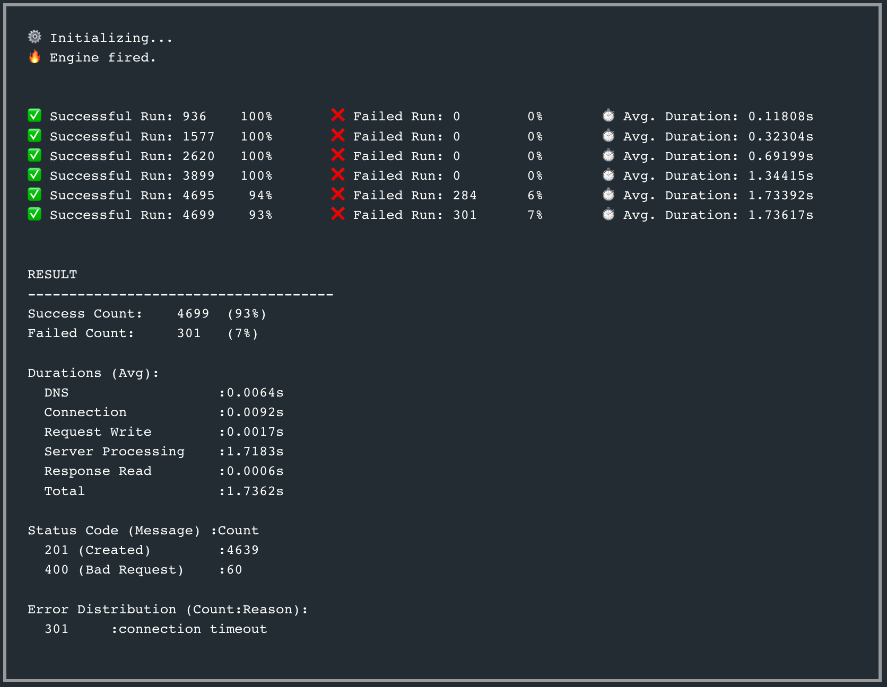

# XM Golang Exercise - v22.0.0

### Company REST Microservice

****
 [](https://codecov.io/github/by-sabbir/company-microservice-rest) [](https://goreportcard.com/report/github.com/by-sabbir/company-microservice-rest)

## Install the Dependencies

```bash
go mod tidy
```

## Run Unit Test

```bash
go test -cover ./internal/company
```
coverage: **81.8%** of statements

## Run DB Integration Test
```bash
go test -cover ./internal/db
```
coverage: **75.3%** of statements

## Run E2E Integration Test

```bash
go test -cover ./internal/transport/http
```
coverage: **73.6%** of statements

## Serve API Service

```bash
make up
```

## Acceptance Test and Endpoints With Postman

[](https://app.getpostman.com/run-collection/19090428-3df486e3-9422-41ce-a9e5-3980f637b078?action=collection%2Ffork&collection-url=entityId%3D19090428-3df486e3-9422-41ce-a9e5-3980f637b078%26entityType%3Dcollection%26workspaceId%3D755b284e-1801-4e9a-a4d8-36fb74cc2021#?env%5BXM-Assessment%5D=W3sia2V5IjoiYmFzZVVybCIsInZhbHVlIjoiaHR0cDovL2xvY2FsaG9zdDo4ODg4IiwiZW5hYmxlZCI6dHJ1ZSwidHlwZSI6ImRlZmF1bHQifSx7ImtleSI6InRva2VuIiwidmFsdWUiOiJleUpoYkdjaU9pSklVekkxTmlJc0luUjVjQ0k2SWtwWFZDSjkuZXlKbGJXRnBiQ0k2SW1aeWIyMXpZV0ppYVhKQVoyMWhhV3d1WTI5dEluMC44QVVfU1VHM3BUcWYwSGdYallwZHRsSndHNjlrd0NPV3VWSWJWdlZBRDhFIiwiZW5hYmxlZCI6dHJ1ZSwidHlwZSI6ImRlZmF1bHQifSx7ImtleSI6ImlkIiwidmFsdWUiOiIiLCJlbmFibGVkIjp0cnVlLCJ0eXBlIjoiZGVmYXVsdCJ9XQ==)

**Additionally**, to view the application log and cleanup run the following:

```bash
make logs
```

and

```bash
make cleanup
```
### Load Test Result



The service can serve **2.5K+ write request/sec** with authentication.

### Features

- Production-grade multi-stage build container only 15MB size.
- JWT Authentication (jwt.io, secret = xm-go-dev)
- Well tested with unittests
- Integration tests embedded
- Graceful shutdown
- Gitworkflow and Codecoverage enabled
- [Event Driven](https://github.com/by-sabbir/company-microservice-rest/tree/ed) with kafka on [`ed`](https://github.com/by-sabbir/company-microservice-rest/tree/ed) branch.
